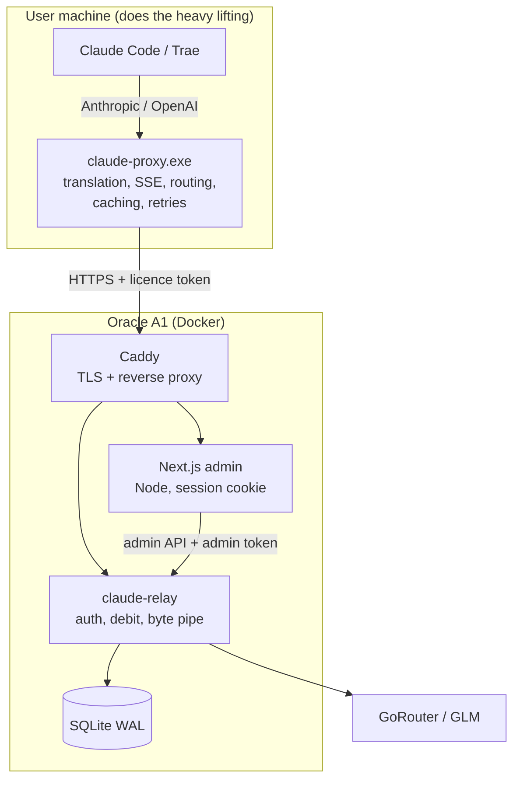

# Claude-Proxy Licensing — Architecture Plan

Status: **approved, in progress**
Host: **Oracle A1 Flex — 12 GB RAM, 2 ARM cores, Docker**
Scale: **< 30 users**

---

## 1. Goals and constraints

| Goal                                          | Consequence                                                       |
| --------------------------------------------- | ----------------------------------------------------------------- |
| Users never receive an upstream API key       | All traffic flows through the relay                               |
| Quota cannot be tampered with locally         | Balances live only in server-side SQLite                          |
| One licence = one machine                     | HWID bound on first activation                                    |
| Minimum VPS load                              | Every computation that is not a security decision runs in the exe |
| Per-user spend **and** per-key dollar balance | Two debits inside one atomic transaction                          |

12 GB removes every memory constraint that shaped the earlier draft. The design
goal is now **simplicity and correctness**, not squeezing into 1 GB.

---

## 2. Architecture



**The relay is the only process that touches SQLite.** Next.js never opens the
database; it calls the relay's `/admin/*` API. One writer means no lock
contention and one code path responsible for money.

The relay is a **byte pipe with a turnstile** — it never parses a response body.

---

## 3. Work pushed to the client exe

The core of the design. All of this already exists in the proxy and stays there,
costing the VPS nothing.

| Computation                                          | Where      | Why it is safe on the client           |
| ---------------------------------------------------- | ---------- | -------------------------------------- |
| Anthropic ⇄ OpenAI request translation               | **Client** | Pure formatting; relay forwards bytes  |
| Anthropic ⇄ OpenAI response translation              | **Client** | Relay never decodes responses          |
| SSE parsing, chunk assembly, re-framing              | **Client** | The expensive per-token work           |
| Keep-alive ping injection on streams                 | **Client** | Presentation only                      |
| Smart routing classification                         | **Client** | Local heuristic, no network call       |
| Model mapping (`MODEL_MAP`)                          | **Client** | Cosmetic; relay prices the real model  |
| Feature defaults (max_tokens, temperature, thinking) | **Client** | Request shaping only                   |
| `count_tokens` estimation                            | **Client** | Never used for billing                 |
| Model catalogue cache (5 min TTL)                    | **Client** | Cuts `/v1/models` traffic to near zero |
| HWID derivation + hashing                            | **Client** | Verified by signature server-side      |
| Retry / backoff on transient errors                  | **Client** | Relay stays stateless                  |
| Access logging, log rotation                         | **Client** | Never leaves the machine               |
| Tray UI, updater, installer                          | **Client** | Already local                          |

### What must stay on the server

Moving any of these makes quota advisory rather than enforced:

- Licence validity and HWID match
- Balance read, debit, refund
- Pooled key storage and selection
- Authoritative usage records
- Per-key dollar balance and rotation

### Per-request server cost

| Step                                      | Cost                       |
| ----------------------------------------- | -------------------------- |
| HMAC-SHA256 token verify                  | ~2 µs                      |
| Extract `model` / `stream` from body      | 0.2–0.5 ms                 |
| SQLite transaction (2 debits + usage row) | 0.3–1 ms                   |
| Pool key selection (in-memory)            | <1 µs                      |
| `io.Copy` stream relay                    | ~0 CPU, I/O bound          |
| **Total**                                 | **≈ 1 ms CPU per request** |

At 30 users that is ~0.2 requests/second — roughly 0.02% of one core.

---

## 4. Deployment (Docker on A1)

No Node on the host; everything runs in containers.

```
docker compose up -d

┌─ caddy ────────────────────────────┐  TLS (Let's Encrypt), routes
│  :80 :443                          │  /v1/* and /admin/api → relay
└──────┬──────────────────────┬──────┘  everything else       → web
       │                      │
┌─ relay ▼──────────┐  ┌─ web ▼─────────────────┐
│ Go + SQLite       │  │ Next.js (Node)         │
│ volume: /data     │  │ holds admin token      │
└───────────────────┘  └────────────────────────┘
```

### Memory on 12 GB

| Component             | RAM              |
| --------------------- | ---------------- |
| OS + Docker daemon    | 250–320 MB       |
| `relay` (Go + SQLite) | 50–80 MB         |
| `web` (Next.js Node)  | 250–450 MB       |
| `caddy`               | 30–50 MB         |
| **Total**             | **≈ 600–900 MB** |
| **Free**              | **≈ 11 GB**      |

With 12 GB there is no reason to avoid the Node runtime, and keeping it lets us
reuse KeyAuth's server-side session and auth code directly rather than rewriting
it as a browser SPA. Node also keeps the admin token **server-side**, out of the
browser entirely.

**Architecture note:** A1 is ARM64. Caddy and Node publish arm64 images; the Go
relay builds with `GOARCH=arm64`. Building the Next.js image on-box is fine at
12 GB.

---

## 5. Website: `Claude-Proxy/web/`

Reuses KeyAuth's patterns rather than starting from scratch.

```
web/
├── PLAN.md
├── Dockerfile
├── docker-compose.yml
├── Caddyfile
├── package.json
├── next.config.mjs
├── app/
│   ├── login/page.jsx            # admin sign-in
│   ├── dashboard/page.jsx        # totals, spend today, active seats
│   ├── licenses/page.jsx         # mint, pause, reset HWID, top up
│   ├── licenses/[id]/page.jsx    # per-seat request history
│   ├── pool/page.jsx             # keys: dollars remaining, rotate, disable
│   └── api/admin/[...path]/route.js   # session-guarded proxy to the relay
├── lib/
│   ├── auth.js       # ← from KeyAuth: HMAC session cookie, timingSafeEqual
│   ├── rateLimit.js  # ← from KeyAuth: in-memory limiter
│   ├── format.js     # ← from KeyAuth, plus cents → dollars
│   ├── clipboard.js  # ← from KeyAuth
│   └── relay.js      # server-side fetch wrapper that attaches the admin token
└── components/       # ← KeyAuth table/card/toast components, restyled
```

### Reused from KeyAuth

| File               | Change                                           |
| ------------------ | ------------------------------------------------ |
| `lib/auth.js`      | Keep HMAC cookie signing; drop reseller sessions |
| `lib/rateLimit.js` | Verbatim                                         |
| `lib/format.js`    | Add cents → dollars                              |
| `lib/clipboard.js` | Verbatim (copy licence key once at mint)         |
| `components/*`     | Reuse tables, cards, toasts                      |
| `app/globals.css`  | Reuse theme                                      |

### Dropped from KeyAuth

Resellers, per-app tenancy, account username/password redemption, Mongo mirror,
password encryption at rest. Not needed: one admin, one product, keys bind
directly to machines.

### Why an API proxy route

`app/api/admin/[...path]/route.js` forwards browser calls to the relay with the
admin token attached server-side. The browser only ever holds a session cookie,
so the admin token cannot leak through devtools or XSS.

---

## 6. Data model (SQLite, WAL)

```sql
CREATE TABLE licenses (
  id            TEXT PRIMARY KEY,
  key_hash      TEXT NOT NULL UNIQUE,   -- SHA-256, never the key itself
  key_hint      TEXT NOT NULL,          -- "CP-A1B2..." for identification
  hwid          TEXT,
  quota_cents   INTEGER NOT NULL,
  spent_cents   INTEGER NOT NULL DEFAULT 0,
  active        INTEGER NOT NULL DEFAULT 1,
  note          TEXT,
  created_at    TEXT NOT NULL,
  bound_at      TEXT,
  last_seen_at  TEXT
);

CREATE TABLE pool_keys (
  id             TEXT PRIMARY KEY,
  label          TEXT,
  provider       TEXT NOT NULL,          -- claude | glm
  secret_enc     BLOB NOT NULL,          -- AES-256-GCM
  balance_cents  INTEGER NOT NULL,       -- dollars loaded onto this key
  spent_cents    INTEGER NOT NULL DEFAULT 0,
  active         INTEGER NOT NULL DEFAULT 1,
  created_at     TEXT NOT NULL,
  last_used_at   TEXT,
  exhausted_at   TEXT
);

CREATE TABLE usage_events (
  id           TEXT PRIMARY KEY,
  license_id   TEXT NOT NULL REFERENCES licenses(id),
  pool_key_id  TEXT NOT NULL REFERENCES pool_keys(id),
  provider     TEXT NOT NULL,
  model        TEXT NOT NULL,
  cost_cents   INTEGER NOT NULL,
  streamed     INTEGER NOT NULL,
  status_code  INTEGER NOT NULL,
  created_at   TEXT NOT NULL
);

CREATE INDEX idx_usage_license ON usage_events(license_id, created_at);
CREATE INDEX idx_usage_key     ON usage_events(pool_key_id, created_at);
CREATE INDEX idx_pool_pick     ON pool_keys(provider, active);
```

Admin credentials live in env (`ADMIN_USER`, `ADMIN_PASSWORD_HASH`) rather than a
table — there is one operator.

### Pragmas

```
journal_mode = WAL
synchronous  = NORMAL     -- safe under WAL, far faster than FULL
busy_timeout = 5000
foreign_keys = ON
```

### The atomic debit

Both balances move in one transaction. This is the entire enforcement mechanism:

```sql
BEGIN IMMEDIATE;
  UPDATE licenses  SET spent_cents = spent_cents + :cost, last_seen_at = :now
    WHERE id = :license AND active = 1 AND spent_cents + :cost <= quota_cents;
  -- 0 rows changed -> quota exhausted, roll back and refuse
  UPDATE pool_keys SET spent_cents = spent_cents + :cost, last_used_at = :now
    WHERE id = :key;
  INSERT INTO usage_events (...) VALUES (...);
COMMIT;
```

SQLite serialises writers, so five concurrent requests with credit for one
cannot all satisfy that `WHERE`.

### Key rotation

`TakePoolKey` picks the active key for the provider with the **highest remaining
balance**. A key that crosses its balance is marked `exhausted_at` and skipped.
If no key has credit, users get a clean capacity error instead of a confusing
upstream failure.

---

## 7. API contracts

### Client → relay

| Endpoint                         | Auth               | Notes                     |
| -------------------------------- | ------------------ | ------------------------- |
| `POST /v1/activate`              | licence key + HWID | Returns token, once       |
| `POST /v1/messages`              | Bearer token       | Metered, streams          |
| `POST /v1/chat/completions`      | Bearer token       | Metered, streams          |
| `POST /v1/messages/count_tokens` | Bearer token       | Free                      |
| `GET /v1/models`                 | Bearer token       | Free, client caches 5 min |

| Status | Meaning                          |
| ------ | -------------------------------- |
| 401    | Not licensed / bad token         |
| 402    | **Usage quota exhausted**        |
| 403    | Licence paused, or wrong machine |
| 503    | No pooled key with credit        |

### Admin → relay

`GET|POST /admin/licenses`,
`POST /admin/licenses/{id}/{pause|resume|reset-hwid|quota}`,
`GET|POST /admin/pool`, `POST /admin/pool/{id}/{enable|disable|delete}`,
`GET /admin/usage`, `GET /admin/stats`.

Guarded by `X-Admin-Token`, attached only by the Next.js server.

---

## 8. Security

| Threat                                    | Mitigation                                        |
| ----------------------------------------- | ------------------------------------------------- |
| User extracts an upstream key             | Keys never leave the VPS                          |
| User edits local balance                  | No local balance exists                           |
| Cheap-model swap (claim haiku, send opus) | Relay prices the **body it forwards**             |
| Licence shared between machines           | HWID bound on activation; admin reset required    |
| Token copied to another machine           | HWID is inside the HMAC payload                   |
| Forged token                              | HMAC-SHA256 with server secret                    |
| DB file exfiltrated                       | Keys hashed; pool secrets AES-256-GCM encrypted   |
| Admin brute force                         | PBKDF2 + rate limit + lockout                     |
| CSRF                                      | `SameSite=Strict` + custom header                 |
| XSS leaking the admin token               | Token never reaches the browser                   |
| Request flooding                          | Per-licence rate limit, body caps, Caddy timeouts |
| Relay down = free usage?                  | Client **fails closed**                           |

### Residual risks (accepted)

- The relay sees all prompts and responses. Unavoidable when metering; body logging stays off in production.
- A user can spoof their own HWID, which only moves their own licence to another machine they control.
- Losing `RELAY_TOKEN_SECRET` invalidates every activation at once. Back it up.

---

## 9. Performance and network

**Relay**

- `MaxIdleConnsPerHost = 100` — the Go default of 2 forces a fresh TLS handshake to GoRouter under concurrency, costing 100 ms+ per request
- HTTP/2 upstream, keep-alive from clients
- 32 KB copy buffer, flush per chunk, `X-Accel-Buffering: no`
- No response parsing — pure `io.Copy`
- Prepared statements on the hot debit path

**Client**

- Persistent keep-alive to the relay
- Model catalogue cached 5 minutes
- Routing decided locally, zero network
- Streams consumed incrementally

**Edge**

- Caddy: automatic TLS, HTTP/2, compression on static assets

**Database**

- WAL + `synchronous=NORMAL`: ~0.3 ms writes
- Nightly `VACUUM INTO` backup

---

## 10. Build phases

| Phase | Work                                                                   | Status      |
| ----- | ---------------------------------------------------------------------- | ----------- |
| 1     | Licence domain: HWID, quota, tokens, pricing                           | **done**    |
| 2     | Relay: auth, metering, pooled keys, admin API                          | **done**    |
| 3     | SQLite store + per-key dollar balances                                 | in progress |
| 4     | Connection pool fix, rate limits                                       | in progress |
| 5     | Client cutover: activation, HWID, fail closed, drop `UPSTREAM_API_KEY` | pending     |
| 6     | Installer: licence key page replaces API key page                      | pending     |
| 7     | Next.js admin site under `web/`                                        | pending     |
| 8     | Docker: images, compose, Caddyfile, backups                            | pending     |
